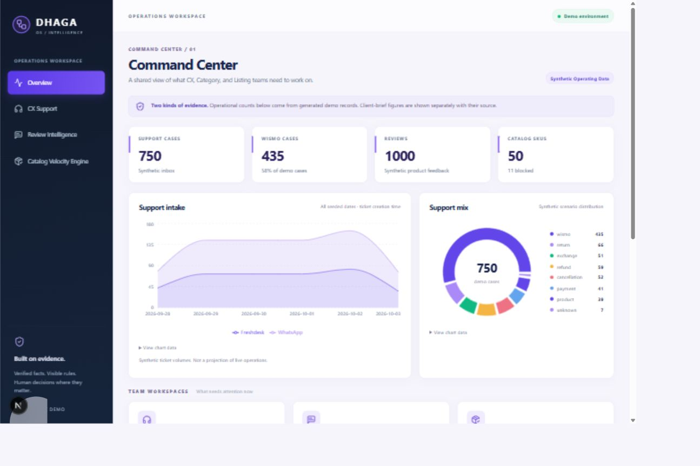
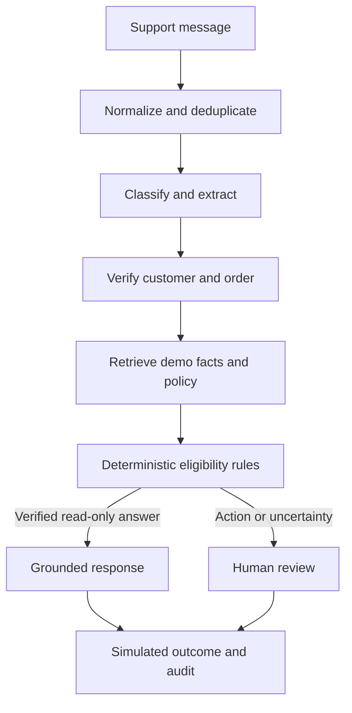
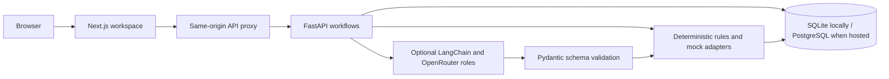

# Dhaga OS

  



**[Open the live Dhaga OS demo](https://dhaga-os.vercel.app)** · [Public source repository](https://github.com/SSengupta01/Dhaga_Os) · [Deployment verification](DEPLOYMENT_REVIEW.md)

Dhaga OS is a synthetic-data operations workspace for customer support, product feedback, and catalog readiness. It gives CX, Category, and Listing teams one place to inspect evidence, prioritize work, and record a decision.

> **Demo boundary:** All operational records are synthetic. The seven-day return/exchange window and pre-dispatch cancellation rule are illustrative demo policies, not Dhaga & Co policy. All customer replies, order actions, and catalog publication are simulated. Do not enter customer, payment, credential, or confidential Dhaga data.

## Start here

1. Read [what this demo does and does not do](#scope-and-safety).
2. Follow [local setup](#run-locally). You need two terminals.
3. Try the [guided workflows](#guided-demo).
4. Review the [architecture](#architecture) before making changes.
5. Run the relevant [checks](#checks) before opening a pull request.

You do not need a cloud account or model key for local use. The default database is SQLite and deterministic rules/read-only templates remain available without a model provider.

## Why Dhaga OS exists

The client engagement brief reports about **9,000 support tickets per week**, **58% WISMO** (roughly **5,220 tickets/week**, derived as 9,000 × 58%), a **nine-hour average first response**, a **six-to-nine-day sample-to-live listing process**, and **410,000 product reviews** not systematically analyzed. These are client-brief context, not measurements from this synthetic application. No row-level Dhaga data or complete production policy handbook was supplied. The demo helps the team inspect a proposed workflow; it does not prove savings or production readiness.

## Scope and safety

| Workspace | What teammates can do |
|---|---|
| **Overview** | Inspect synthetic workload across teams, seed and policy versions, and separately labeled client-brief context. |
| **CX Support** | Investigate WISMO, returns/exchanges, refunds, cancellations, payment questions, and product/policy questions; inspect facts and rules; approve, edit, or escalate a proposed next step. |
| **Review Intelligence** | Filter product feedback, inspect supporting review evidence, and open or update human-owned investigations. |
| **Catalog Velocity Engine** | Inspect vendor drafts, provenance, readiness blockers, normalize known aliases, run QA, request guarded copy, validate CSV intake, and approve a publish-ready export. |

**Rules that matter:** an order ID alone does not establish ownership; stale or missing tracking cannot become a delivery promise; unsupported or conflicting policy leads to abstention/escalation; model output cannot authorize refunds, returns, exchanges, cancellations, compensation, payments, or publication. Refund follows inspection with no timing promise. Review correlation is not proof of vendor causation. All consequential actions are mock/demo records only.

## Guided demo

### CX Support

Open **CX Support → Live tickets**, choose a seeded case, and run the workflow. Useful examples:

| Ticket | Scenario | Expected result |
|---|---|---|
| TKT00001 | Normal WISMO | Verified demo facts and grounded read-only response. |
| TKT00002 | Wrong customer | Ownership mismatch blocks protected facts and actions. |
| TKT00003 | Carrier timeout | No invented delivery promise; escalate with a reason. |
| TKT00004 | Return proposal | Inspect illustrative policy and human approval requirement. |
| TKT00014 | Unsupported policy | Abstain and route for human review. |

Inspect retrieved facts, policy/rule, reason codes, trace, and audit history. Try **Approve**, **Edit**, or **Escalate** where shown; each records a demo decision only. The seed includes 50 named guardrail scenarios.




### Review Intelligence

Open **Product signals**, filter by category/issue, and inspect the review text supporting a trend. Small samples are suppressed from alerts. Create an investigation and update it under **Investigations**. Model extraction is optional; extracted evidence must match the source review. Synthetic issue signals are not real product defects or vendor verdicts.

### Catalog Velocity Engine

Open **Product pipeline**, inspect a blocked SKU’s vendor input, canonical fields, provenance, milestones, and blockers. Try known-colour normalization and QA; guarded copy needs a configured model. Correct only fields supported by source evidence. Approve an export only for eligible demo products. Vendor CSV intake validates rows before making demo drafts; nothing is published to a storefront.

## Run locally

### Requirements

Git, Node.js 20.9+, npm, Python 3.12, and [uv](https://docs.astral.sh/uv/). Commands below use PowerShell from the repository root.

### 1. Clone the repository

```powershell
git clone https://github.com/SSengupta01/Dhaga_Os.git
cd Dhaga_Os
```

### 2. Start the API (Terminal 1)

```powershell
cd api
uv sync --extra dev
Copy-Item .env.example .env
uv run alembic upgrade head
uv run python -m dhaga.seed reset
uv run python -m dhaga.seed verify
uv run uvicorn app:app --reload --port 8000
```

API: http://localhost:8000 · API docs: http://localhost:8000/docs · health: http://localhost:8000/health.

### 3. Start the web app (Terminal 2)

From the repository root in a second terminal:

```powershell
cd web
npm ci
Copy-Item .env.example .env.local
npm run dev
```

Open **http://localhost:3000**. Keep both terminals running. The example session secret is for local use only; if you change it, use the same value in the web and API environments and restart both services.

### 4. Optional model calls

Set `OPENROUTER_API_KEY` in **api/.env only**, restart the API, then run the model smoke test. Do not put provider keys in a `NEXT_PUBLIC_*` variable or commit them. Default configurable roles are `openai/gpt-4o-mini` for classifier/extractor/mapper work and `openai/gpt-4o` for evaluation/copy work. Extraction, classification, and evaluation use temperature 0.0; optional copy generation uses 0.2. Provider calls may incur charges.

## Architecture

`web/` is Next.js/TypeScript. It calls a same-origin API proxy and keeps the demo session in an HttpOnly cookie. `api/` is FastAPI/Python, with LangChain/OpenRouter roles, Pydantic output schemas, deterministic policy decisions, mock commerce adapters, analytics, and audit traces. Models are optional and replaceable; invalid schemas, provider failures, missing evidence, or unsupported policies stop the affected path or route it for human review.



### Repository map

| Path | Purpose |
|---|---|
| `web/app/`, `web/components/` | Workspace routes, shared UI, charts, and CX views. |
| `web/lib/` | API client and generated types. |
| `api/dhaga/main.py` | FastAPI application and routes. |
| `api/dhaga/logic.py` | CX workflow, verification, and deterministic rules. |
| `api/dhaga/workflows.py`, `api/dhaga/llm.py` | Review/catalog workflows and LangChain roles. |
| `api/dhaga/seed.py`, `api/dhaga/policies.json` | Fixed-seed synthetic data and versioned demo policies. |
| `api/alembic/`, `api/evals/`, `api/tests/` | Migrations, held-out labels, and tests. |
| `vercel.json` | Single Vercel project configuration for web and API. |

## Demo data and configuration

Seed version **2026-10-03-seed-v1** creates 750 customers, 3,000 linked orders/shipments, 750 tickets (435 WISMO), 1,000 reviews, 50 products, five vendors, and 50 guardrail cases. Evaluation labels in `api/evals/cx_cases.json` are hand-authored separately from generated records. Dashboard counts query the configured database; brief figures are separately labeled.

From `api/`, `uv run python -m dhaga.seed verify` checks counts and relationships. `uv run python -m dhaga.seed reset` destroys current demo records and decisions, then recreates the seed. Do not run reset against data you need.

| Variable | Purpose |
|---|---|
| `DATABASE_URL` | SQLite by default; may point to PostgreSQL. |
| `OPENROUTER_API_KEY` | Optional server-only model key. |
| `CLASSIFIER_MODEL`, `EVALUATOR_MODEL` | Replaceable OpenRouter model IDs. |
| `DEMO_SESSION_SECRET` | Shared internal web/API proxy token; use a strong production value. |
| `API_BASE_URL` | Local web-to-API origin; Vercel uses its configured internal service binding. |

## Checks

From `api/`:

```powershell
uv run alembic upgrade head
uv run python -m dhaga.seed verify
uv run pytest -q
uv run python -m scripts.evaluate
uv run ruff check --select E4,E7,E9,F dhaga tests scripts
```

From `web/`:

```powershell
npm ci
npm run check
npm run build
```

For a model swap, set your key, run `uv run python -m scripts.model_smoke` from `api/`, and compare held-out decisions, guardrails, schema failures, latency, and cost. A successful single request is not enough to accept a swap. API schema changes require `npm run types` at the root and review of `api/openapi.json` and `web/lib/openapi.generated.ts`.

## Deployment and contributing

The public app is at **https://dhaga-os.vercel.app**. The public repository deploys as **one Vercel project** using root `vercel.json`; it configures the Next.js web and FastAPI services together. Production needs managed PostgreSQL, a strong shared `DEMO_SESSION_SECRET`, migrations, and a fresh seed. Add `OPENROUTER_API_KEY` only if live model features are desired. Verify the health endpoint, model mode, deployed UI, and matching GitHub commit. Review [DEPLOYMENT_REVIEW.md](DEPLOYMENT_REVIEW.md), [FINAL_REVIEW.md](FINAL_REVIEW.md), and [VERIFICATION.md](VERIFICATION.md).

The public demo has no full user authentication or per-user isolation. Keep it synthetic. Before a real pilot, add Dhaga-approved identity/roles, data-retention controls, security review, provider spend limits, monitoring, rollback, approved policies, and live integrations.

For changes: branch from current main; keep client facts, synthetic fixtures, and measured results distinct; add tests for both happy and failure paths; run relevant checks; open a PR with screenshots for UI changes and commands/tests run. Never commit .env files, databases, real customer data, or provider keys.

## Troubleshooting

| Symptom | Check |
|---|---|
| Web/API network error | Start the API on port 8000; check `API_BASE_URL`; restart web after env changes. |
| Missing tables or DB unavailable | From `api/`, run Alembic upgrade; verify `DATABASE_URL`. |
| Model unavailable | Check `api/.env`, restart API, run model smoke test. |
| Schema/provider failure | Check model ID, access, key, and usage; inspect trace. Safe path should stop/escalate. |
| Vercel API error | Check shared production session secret, service binding, health route, and deployment logs. |

## Useful references

[Client engagement brief](FDE_Academy_Tech_Track_Mini_Project_1_Dhaga_and_Co_Client_Engagement.pdf) · [CX feature context](Dhaga_CX_Support_Intelligence_Codex_Context_REVIEWED_v2.md) · [Review Intelligence source](dhaga_review_intelligence_feature_sot.md) · [Catalog source](dhaga_catalog_velocity_feature_sot.md) · [Discovery note](DISCOVERY.md) · [Vercel Services](https://vercel.com/docs/services) · [LangChain OpenRouter](https://docs.langchain.com/oss/python/integrations/chat/openrouter)
